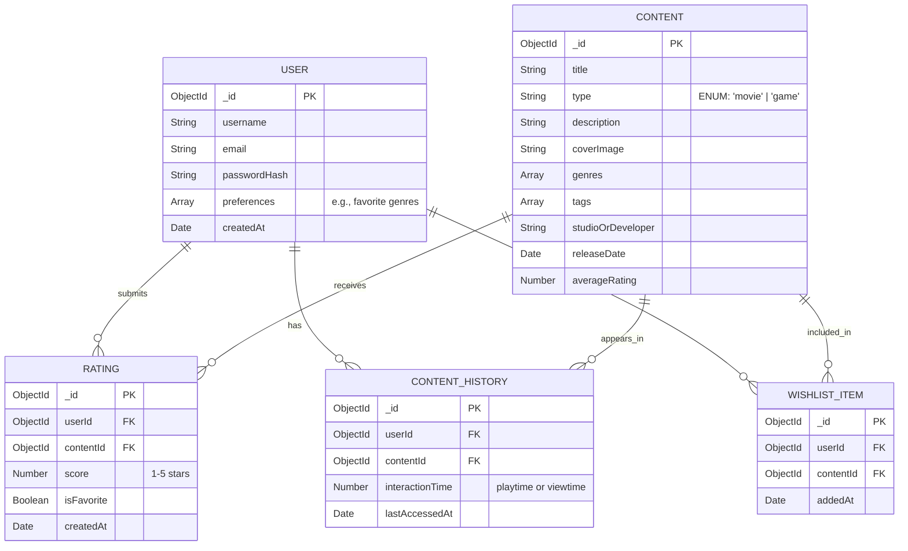

# Entity Relationship (ER) Diagram

The database uses MongoDB. Below is the relational structure of the main entities in the **Kairo** application (Version 1).

## Core Entities Description

1. **User**: Represents a consumer on the platform. Stores credentials and high-level preferences.
2. **Content**: A unified model representing both movies and games. The `type` field dictates whether it is a movie or a game. Includes metadata, tags, and genres needed for content-based filtering.
3. **Rating**: A user's explicit feedback on a piece of content (score and favorite status).
4. **ContentHistory**: Tracks what the user has viewed or played, acting as implicit feedback for the recommendation engine.
5. **WishlistItem**: Content the user is interested in but hasn't necessarily engaged with yet.
